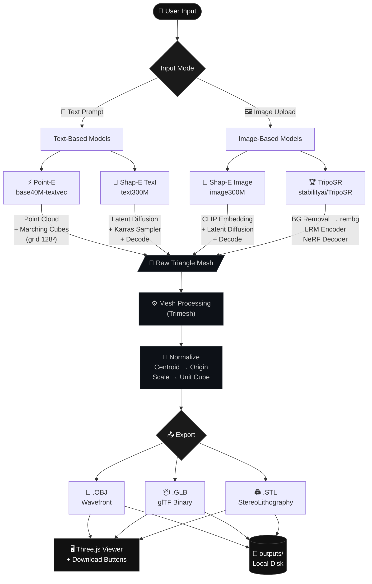
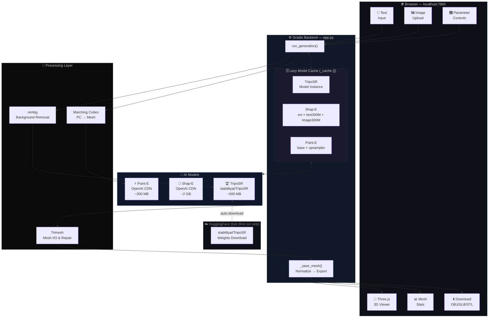
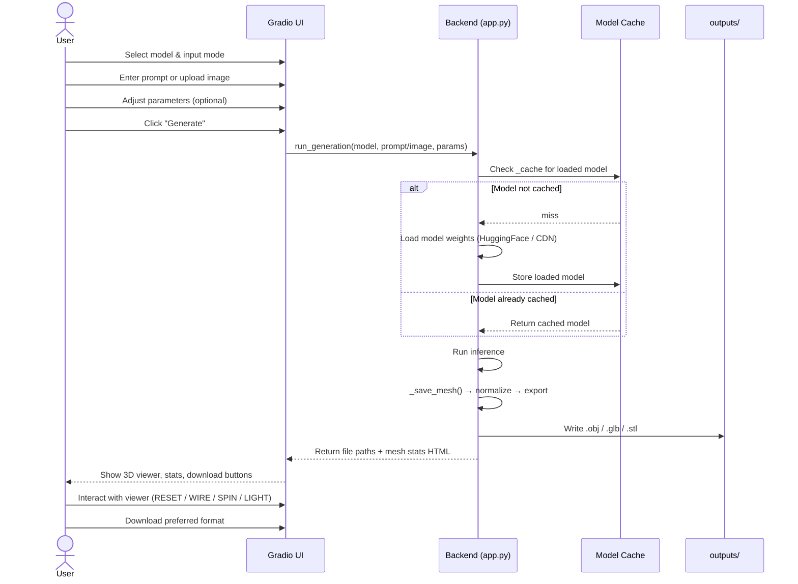
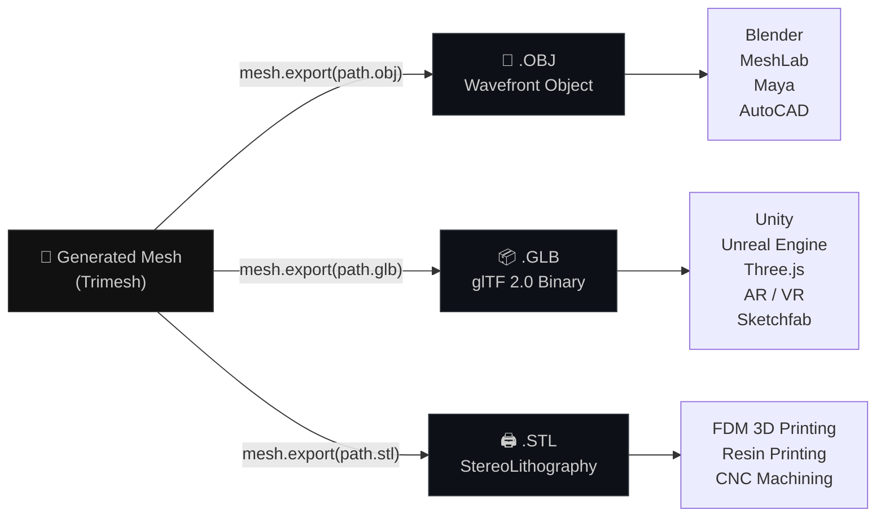
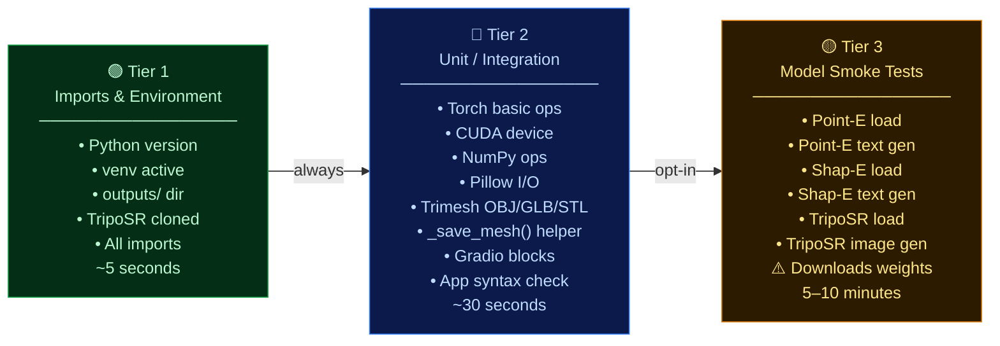
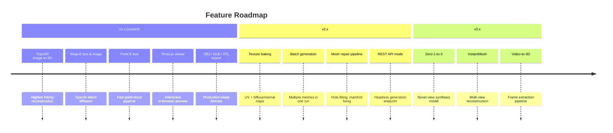

<div align="center">


<br/>

[](https://python.org)
[](https://pytorch.org)
[](https://gradio.app)
[](LICENSE)
[](https://github.com)
[](https://github.com/ranker-002/3DG/pulls)

<br/>

> **Generate production-ready OBJ / GLB / STL meshes from text prompts or images.**
> Four state-of-the-art models. Zero cost. Zero cloud dependency. Zero API keys.

<br/>

```

> ⚠️ **Tip:** Open this file on [GitHub](https://github.com/ranker-002/3DG) to see rendered Mermaid diagrams and badges.

```

---

## ✨ Highlights

|  | Feature |
|---|---|
| 🧠 | **4 AI models** — TripoSR, Shap-E (text & image), Point-E |
| 🔒 | **Fully offline** — no API keys, no subscriptions, no data leaves your machine |
| 🖥️ | **Interactive 3D viewer** — embedded Three.js viewport with orbit controls |
| 📦 | **3 export formats** — `.obj`, `.glb`, `.stl` for every workflow |
| ⚡ | **GPU & CPU** — CUDA-accelerated or pure CPU fallback |
| 🧪 | **Comprehensive tests** — 3-tier test suite covering imports → inference |
| 🪟 | **Cross-platform** — `install.sh` for Linux/macOS, `run.ps1` for Windows |

</div>

---

## 📑 Table of Contents

- [Pipeline Overview](#-pipeline-overview)
- [System Architecture](#-system-architecture)
- [Models](#-models)
- [Quick Start](#-quick-start)
- [Installation](#-installation)
  - [Linux / macOS](#linux--macos)
  - [Windows](#windows)
  - [Manual Install](#manual-install)
- [Usage](#-usage)
- [UI Walkthrough](#-ui-walkthrough)
- [Model Reference](#-model-reference)
- [Parameters](#-parameters)
- [Output Formats](#-output-formats)
- [Hardware Requirements](#-hardware-requirements)
- [Test Suite](#-test-suite)
- [Project Structure](#-project-structure)
- [Contributing](#-contributing)
- [License](#-license)

---

## 🔄 Pipeline Overview



---

## 🏗️ System Architecture



---

## 🧠 Models

| | Model | Licence | Input | GPU Speed | Quality | Best For |
|---|---|---|---|---|---|---|
| 🏆 | **TripoSR** | MIT | Image | ~5 s | ⭐⭐⭐⭐⭐ | Highest fidelity single-image reconstruction |
| 🔷 | **Shap-E Text** | MIT | Text | ~20 s | ⭐⭐⭐⭐ | Rich descriptive text prompts |
| 🖼️ | **Shap-E Image** | MIT | Image | ~20 s | ⭐⭐⭐⭐ | Image input with text-level control |
| ⚡ | **Point-E** | MIT | Text | ~8 s | ⭐⭐⭐ | Fast prototyping, coloured point clouds |

> All model weights are **downloaded automatically** on first run. No manual setup required.

---

## 🚀 Quick Start

```bash
git clone https://github.com/ranker-002/3DG.git
cd 3DG

# Linux / macOS — one command does everything
chmod +x install.sh && ./install.sh

# Activate and launch
source .venv/bin/activate
python app.py
# → Open http://localhost:7860
```

```powershell
# Windows PowerShell — one command launch (after manual install)
.\run.ps1
```

---

## 📦 Installation

### Linux / macOS

```bash
# Clone
git clone https://github.com/ranker-002/3DG.git
cd 3DG

# Auto-detect CUDA and install everything
chmod +x install.sh
./install.sh          # auto-detect GPU

# — or — force CPU-only
./install.sh cpu
```

The script will:

1. Verify Python 3.10+
2. Create a `.venv` virtual environment
3. Install PyTorch with the correct CUDA index URL
4. Install Shap-E, TripoSR, Point-E from source
5. Install all remaining dependencies from `requirements.txt`

---

### Windows

```powershell
git clone https://github.com/ranker-002/3DG.git
cd 3DG

# 1 — Create venv
python -m venv .venv
.venv\Scripts\Activate.ps1

# 2 — PyTorch (CUDA 12.1)
pip install torch torchvision --index-url https://download.pytorch.org/whl/cu121

# 3 — AI models from source
pip install git+https://github.com/openai/shap-e.git
pip install git+https://github.com/VAST-AI-Research/TripoSR.git
pip install git+https://github.com/openai/point-e.git

# 4 — Remaining deps
pip install -r requirements.txt

# 5 — Launch
python app.py
```

Or use the provided launcher after the steps above:

```powershell
.\run.ps1
```

---

### Manual Install

<details>
<summary>Click to expand — step-by-step with all options</summary>

```bash
# PyTorch variants
# CUDA 12.1 (RTX 30xx / 40xx)
pip install torch torchvision --index-url https://download.pytorch.org/whl/cu121

# CUDA 11.8 (GTX 10xx / 20xx)
pip install torch torchvision --index-url https://download.pytorch.org/whl/cu118

# CPU-only
pip install torch torchvision --index-url https://download.pytorch.org/whl/cpu

# Models (MIT licensed, installed from source)
pip install git+https://github.com/openai/shap-e.git
pip install git+https://github.com/VAST-AI-Research/TripoSR.git
pip install git+https://github.com/openai/point-e.git

# Core dependencies
pip install -r requirements.txt

# Optional (performance improvements)
pip install pyfqmr       # faster quadric mesh decimation
pip install xatlas       # GPU-accelerated UV unwrapping
pip install open3d       # advanced point-cloud operations
```

</details>

---

## 🎮 Usage

```bash
# Start the Gradio web server
python app.py

# The UI is available at:
http://localhost:7860
```

---

## 🖥️ UI Walkthrough



### Viewer Controls

| Button | Action |
|---|---|
| **RESET** | Return camera to default position |
| **WIRE** | Toggle wireframe / solid rendering |
| **SPIN** | Toggle auto-rotation |
| **LIGHT** | Cycle through 4 studio lighting presets |

> **Orbit** — Left-click drag · **Zoom** — Scroll wheel · **Pan** — Right-click drag

---

## 📖 Model Reference

### 🏆 TripoSR

> *Stability AI × Tripo AI · MIT License*

- **Paper:** [TripoSR: Fast 3D Object Reconstruction from a Single Image (2024)](https://arxiv.org/abs/2403.02156)
- **Weights:** `stabilityai/TripoSR` on HuggingFace (~500 MB, auto-downloaded)
- **Architecture:** Large Reconstruction Model (LRM) — transformer encoder + triplane NeRF decoder
- **Pipeline:** `rembg` background removal → foreground resize (0.85 ratio) → LRM encoding → marching-cubes mesh extraction

**Image Tips:**

```
✅ Clean white or transparent background
✅ Single object, centred and well-lit
✅ Unambiguous silhouette
✅ Front-facing or 3/4 view
❌ Cluttered scenes
❌ Multiple overlapping objects
❌ Motion blur or heavy bokeh
```

---

### 🔷 Shap-E Text / Image

> *OpenAI · MIT License*

- **Paper:** [Shap-E: Generating Conditional 3D Implicit Functions (2023)](https://arxiv.org/abs/2305.02463)
- **Weights:** OpenAI CDN (~2 GB total, auto-downloaded on first run)
- **Architecture:** Latent diffusion conditioned on CLIP text/image embeddings → implicit 3D function → triangle mesh via `decode_latent_mesh`
- **Sampler:** Karras noise schedule with configurable steps and guidance scale

**Text Prompt Tips:**

```
✅ "a dark oak rocking chair with spindle back and curved runners"
✅ "matte black sci-fi helmet with blue visor and angular vents"
✅ "low-poly cartoon cactus in a small terracotta pot"
✅ "smooth white ceramic coffee mug with a C-shaped handle"
❌ "chair"           (too vague, no style or material)
❌ "a thing"         (no semantic content)
❌ "landscape"       (scenes not single objects — use images instead)
```

---

### ⚡ Point-E

> *OpenAI · MIT License*

- **Paper:** [Point-E: A System for Generating 3D Point Clouds from Complex Prompts (2022)](https://arxiv.org/abs/2212.08751)
- **Weights:** OpenAI CDN (~300 MB, auto-downloaded)
- **Architecture:** GLIDE-style image diffusion → 4,096-point coloured cloud via upsampler → marching-cubes mesh (128³ grid)
- **Fastest option** — best for rapid iteration and prototyping

---

## 🎛️ Parameters

| Parameter | Models | Range | Default | Description |
|---|---|---|---|---|
| **Guidance Scale** | Shap-E | 3 – 20 | 15 | Classifier-free guidance strength — higher = more prompt-adherent, less diverse |
| **Diffusion Steps** | Shap-E, Point-E | 16 – 128 | 64 | Karras denoising steps — more steps = higher quality, slower |
| **MC Resolution** | TripoSR | 128 – 512 | 256 | Marching-cubes grid resolution — higher = more detail, more VRAM |
| **Seed** | All | 0 – 2³² | 0 | Random seed for reproducibility — same seed + prompt = same mesh |

---

## 📤 Output Formats



All meshes are automatically:
- **Centred** at the world origin (`centroid → [0, 0, 0]`)
- **Normalized** to a unit cube (`max(extents) = 1.0`)
- **Stamped** with a unique 8-char hex ID to prevent overwrites

---

## 💻 Hardware Requirements

| | Minimum | Recommended | Ideal |
|---|---|---|---|
| **GPU VRAM** | 4 GB | 8 GB | 16 GB+ |
| **RAM** | 8 GB | 16 GB | 32 GB |
| **Disk (models)** | 3 GB | 6 GB | 12 GB |
| **GPU** | GTX 1060 6 GB | RTX 3070 | RTX 4090 |
| **CPU** | Any 4-core | 8-core | 12-core+ |

### Expected Inference Times

```mermaid
gantt
    title Approximate Generation Time per Model (RTX 3080)
    dateFormat  X
    axisFormat  %ss

    section TripoSR
    Image → Mesh       :0, 5

    section Point-E
    Text → Mesh        :0, 8

    section Shap-E Text
    Text → Mesh        :0, 20

    section Shap-E Image
    Image → Mesh       :0, 22
```



> **CPU inference works** but expect 2–10 minutes per model. Weights are cached after the first load, so subsequent generations in the same session are faster.

---

## 🧪 Test Suite

The project ships with a comprehensive 3-tier test suite in `run_tests.py`.



### Running Tests

```bash
# Tier 1 + 2 only (fast, no model downloads)  — DEFAULT
python run_tests.py

# All tiers including model inference (downloads weights on first run)
python run_tests.py --all

# A specific tier only
python run_tests.py --tier 1
python run_tests.py --tier 2
python run_tests.py --tier 3

# Verbose error output
VERBOSE=1 python run_tests.py --all
```

### Test Coverage Summary

| Tier | Tests | Scope |
|---|---|---|
| T1 | 17 | Python env, venv, directory structure, all package imports |
| T2 | 16 | PyTorch ops, NumPy, Pillow I/O, Trimesh export, Gradio blocks, app syntax |
| T3 | 6 | Full model load + 1-step inference for each model |

---

## 🗂️ Project Structure

```
3DG/
├── 📄 app.py                  ← Main application: model logic + Gradio UI
│   ├── _load_shap_e()         │  Lazy loader with _cache{} dict
│   ├── _load_point_e()        │
│   ├── _load_triposr()        │
│   ├── shap_e_text()          │  Generation functions
│   ├── shap_e_image()         │
│   ├── triposr_image()        │
│   ├── point_e_text()         │
│   ├── run_generation()       │  Main Gradio callback
│   ├── VIEWER_HTML            │  Embedded Three.js viewport
│   └── HEADER_SVG             │  Decorative SVG banner
│
├── 🧪 run_tests.py            ← 3-tier test suite (52 test functions)
├── 🔬 test_imports.py         ← Quick import sanity check
│
├── 🛠️ install.sh              ← One-command installer (Linux/macOS)
├── 🪟 run.ps1                 ← Windows PowerShell launcher
├── 📋 requirements.txt        ← Python dependencies
│
├── 📁 TripoSR/                ← TripoSR source (git submodule)
│   └── tsr/                   │  tsr.system.TSR, tsr.utils.*
│
├── 📁 outputs/                ← Generated meshes (gitignored)
│   └── <model>_<uid>.{obj,glb,stl}
│
└── 📁 .venv/                  ← Virtual environment (gitignored)
```

---

## 🔮 Roadmap



---

## 🤝 Contributing

Contributions are very welcome! Here's how to get started:

```bash
# 1. Fork and clone
git clone https://github.com/<your-username>/3DG.git
cd 3DG

# 2. Create a feature branch
git checkout -b feature/my-awesome-feature

# 3. Set up environment
./install.sh

# 4. Make your changes, then verify
python run_tests.py        # must pass T1 + T2
python run_tests.py --all  # run before opening a PR

# 5. Commit and push
git commit -m "feat: add my awesome feature"
git push origin feature/my-awesome-feature

# 6. Open a Pull Request on GitHub
```

### Contribution Guidelines

| Area | Notes |
|---|---|
| **New model** | Add a `_load_<model>()` + generation function, wire into `run_generation()`, add T3 smoke test |
| **Bug fix** | Include a failing T2 test that your fix makes pass |
| **UI change** | Screenshot or screen-recording in the PR description |
| **Deps** | Pin to a minimum version range, keep all licences MIT / Apache 2.0 |

---

## 📄 License

```
MIT License

Copyright (c) 2025 ranker-002

Permission is hereby granted, free of charge, to any person obtaining a copy
of this software and associated documentation files (the "Software"), to deal
in the Software without restriction, including without limitation the rights
to use, copy, modify, merge, publish, distribute, sublicense, and/or sell
copies of the Software, and to permit persons to whom the Software is
furnished to do so, subject to the following conditions:

The above copyright notice and this permission notice shall be included in all
copies or substantial portions of the Software.
```

### Dependency Licences

| Package | Licence | Link |
|---|---|---|
| TripoSR | MIT | [VAST-AI-Research/TripoSR](https://github.com/VAST-AI-Research/TripoSR) |
| Shap-E | MIT | [openai/shap-e](https://github.com/openai/shap-e) |
| Point-E | MIT | [openai/point-e](https://github.com/openai/point-e) |
| Trimesh | MIT | [mikedh/trimesh](https://github.com/mikedh/trimesh) |
| Gradio | Apache 2.0 | [gradio-app/gradio](https://github.com/gradio-app/gradio) |
| PyTorch | BSD-3 | [pytorch/pytorch](https://github.com/pytorch/pytorch) |
| rembg | MIT | [danielgatis/rembg](https://github.com/danielgatis/rembg) |
| Three.js | MIT | [mrdoob/three.js](https://github.com/mrdoob/three.js) |

---

<div align="center">


**Built with ❤️ using only open-source, MIT-licensed AI models.**

*No cloud. No keys. No cost.*

[](https://github.com/ranker-002/3DG)

</div>